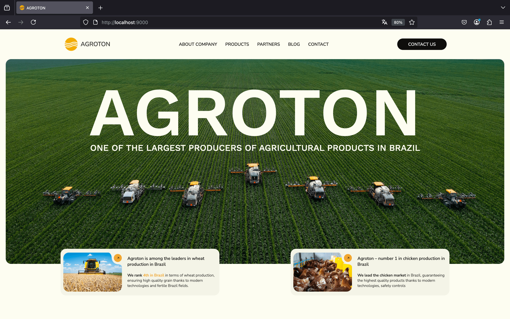
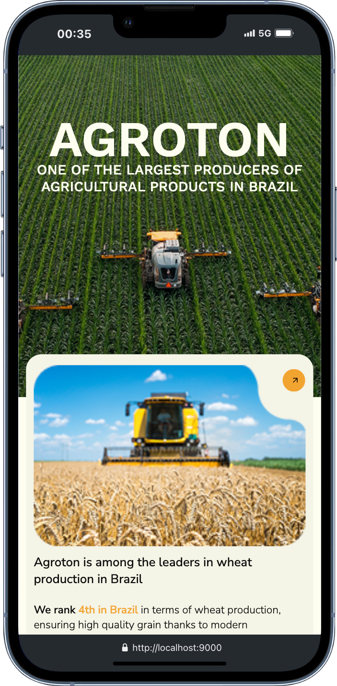

# AgrotonWebsite

A responsive website layout for the **Agroton** company, built using **HTML**, **CSS**, and **JavaScript**.  
This project demonstrates modern front-end development practices, clean design, and cross-device adaptability.

## 🌐 Demo

Live Preview: *(https://loysboy98.github.io/AgrotonWebsite/)*

## 📷 Screenshots

  
*Desktop version*

  
*Mobile version*

## 🚀 Features

- ✅ Fully responsive layout (Mobile, Tablet, Desktop)
- 🎨 Clean and modern UI
- 🌙 Light theme support
- ⚡ Optimized HTML, CSS, and JavaScript
- 📁 Easy to maintain file structure

## 🛠️ Technologies Used

- HTML5
- CSS3 (Flexbox, Grid)
- JavaScript (Vanilla)
- Google Fonts & Icons

## 📂 Folder Structure
AgrotonWebsite/
├── css/
│ └── style.css
├── js/
│ └── script.js
├── images/
├── index.html
└── README.md

## 📦 How to Use

1. Clone this repository:

   ```bash
   git clone https://github.com/loysboy98/AgrotonWebsite.git
   
2. Figma link : https://drive.google.com/file/d/1dD4TgxFUIfyuRiv7rkvP_q0H0ULkS7vm/view

👨‍💻 Author
@vadymprokopchuk | От 0 до 1
GitHub: @loysboy98
